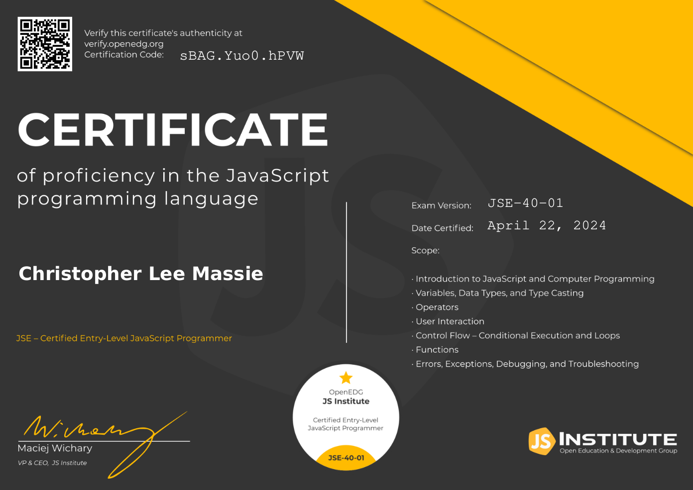

# JavaScript Certifications Progress

Welcome to my JavaScript certification journey. This repository is dedicated to sharing the scripts and projects I've developed while studying for certifications offered by the [JavaScript Institute](https://js.institute/). The goal of this repository is to document my progress and growth as a JavaScript developer, showcasing the evolution of my skills from the fundamentals to more advanced topics in JavaScript programming.

## About The JavaScript Institute

The JavaScript Institute aims to foster professional development in JavaScript programming through a structured certification program. Their certifications are designed to validate the knowledge and skills of JavaScript developers at various levels, from entry-level to advanced programmers, through a rigorous examination process. For an in-depth look at the certifications available, refer to their [Certification Roadmap](https://js.institute/jse-certification).

## Certification Verification

To ensure the authenticity and validity of the certifications, you can verify them through the [Certification Verification Page](https://verify.openedg.org).

## Certification Roadmap and Progress

As I navigate through the JavaScript Institute's certification tracks, here's a snapshot of my progress and the certifications I am working toward:

### Entry-Level

- [x] **JSE – Certified Entry-Level JavaScript Programmer Certification**

  > The JSE certification helped me formalize my JavaScript skills, focusing on core language fundamentals, including syntax, data types, and basic programming techniques.
  >
  >  > **Certification Code**: `sBAG.Yuo0.hPVW`
  >
  > [Verify Digital Certificate](https://verify.openedg.org/?id=sBAG.Yuo0.hPVW)
  >
  > [Certification Details](https://js.institute/jse-certification)

### Associate Level

- [ ] **JSA – Certified Associate JavaScript Programmer Certification**

  > Moving beyond the basics, the JSA certification delves into more complex JavaScript concepts and development practices, setting the foundation for advanced programming and application development.
  >
  > [Certification Details](https://js.institute/jsa-certification)
